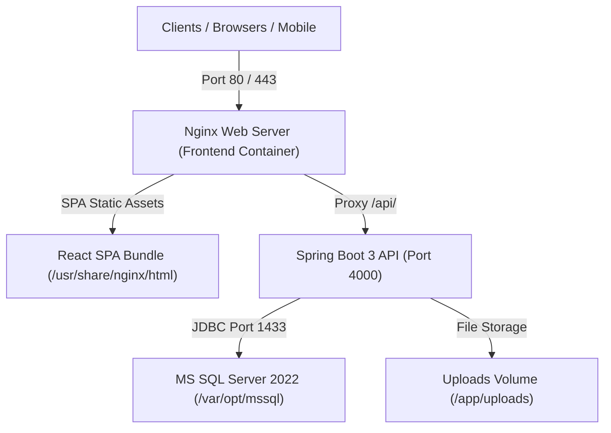

# Enterprise Field Visit & CRM System - Server Deployment Guide

This guide provides end-to-end instructions for deploying the **Enterprise Field Visit & CRM System** on any cloud or on-premise server (Ubuntu, Debian, RHEL, AWS EC2, DigitalOcean, Azure VM, etc.) using Docker & Docker Compose.

---

## 1. System Architecture



- **Frontend Container (`field-crm-frontend`)**: Nginx Alpine serving the production React Vite application with client-side SPA routing and proxying `/api/` requests to the backend.
- **Backend Container (`field-crm-backend`)**: Eclipse Temurin 21 JRE running Spring Boot 3 with G1GC memory optimization and OpenAPI documentation at `/swagger-ui.html`.
- **Database Initializer (`field-crm-sqlserver-init`)**: Automatically creates the `field_visit` database on first run if not already present.
- **Database Container (`field-crm-sqlserver`)**: Microsoft SQL Server 2022 with persistent Docker volume storage.

---

## 2. Server Prerequisites

Ensure the following tools are installed on your target server:
- **Git**: `sudo apt install -y git`
- **Docker Engine** (v24+): [Install Docker Engine](https://docs.docker.com/engine/install/ubuntu/)
- **Docker Compose** (v2.20+): Included with Docker Compose plugin (`docker compose`)

Verify installation on your server:
```bash
docker --version
docker compose version
```

---

## 3. Quick Start Deployment (1-Click)

### Step 1: Clone the Repository
```bash
git clone <YOUR_GIT_REPOSITORY_URL> /opt/field-crm
cd /opt/field-crm
```

### Step 2: Configure Environment Variables
```bash
cp .env.example .env
```
Edit `.env` to configure your server parameters:
```bash
nano .env
```
Key settings to customize:
- `DB_PASSWORD`: Set a secure SA password (at least 8 chars with uppercase, lowercase, numbers, and symbols).
- `JWT_SECRET`: Generate a secure 64+ character random secret string.
- `FRONTEND_PORT`: `80` (or `3000` if behind an existing host reverse proxy).
- `BACKEND_PORT`: `4000`.

### Step 3: Run the Deployment Script
```bash
chmod +x deploy.sh
./deploy.sh up
```

Alternatively, run standard Docker Compose commands:
```bash
docker compose up -d --build
```

---

## 4. Verification & Access

Once started, verify that all containers are healthy:
```bash
./deploy.sh status
# OR: docker compose ps
```

| Service | Access URL | Description |
| :--- | :--- | :--- |
| **Web Application** | `http://<SERVER_IP>:<FRONTEND_PORT>` | CRM Web Portal & Dashboard |
| **Backend REST API** | `http://<SERVER_IP>:<BACKEND_PORT>/api` | Spring Boot REST API |
| **API Documentation** | `http://<SERVER_IP>:<BACKEND_PORT>/swagger-ui.html` | Interactive Swagger OpenAPI UI |
| **MS SQL Server** | `<SERVER_IP>:1433` | Database Server |

### Default Admin Credentials
- **Email**: `admin@crm.com`
- **Password**: `Password@123`

*(Please change the default password after your first login via User Management or Profile settings)*

---

## 5. Deployment Management Commands

The included [`deploy.sh`](file:///f:/iqraProjects/FullStack/Field%20management/deploy.sh) script provides convenient administrative shortcuts:

```bash
# Check container status and health
./deploy.sh status

# View live consolidated logs
./deploy.sh logs

# View logs for a specific service (backend, frontend, sqlserver)
./deploy.sh logs backend

# Restart all services
./deploy.sh restart

# Pull latest code from git, rebuild, and reload seamlessly
./deploy.sh update

# Stop application and tear down containers
./deploy.sh down
```

---

## 6. Production HTTPS / SSL Setup (Optional)

If you are pointing a domain (e.g. `crm.yourcompany.com`) directly to this server, you can set up HTTPS using **Certbot / Nginx** or **Cloudflare**:

### Using Host Nginx with Let's Encrypt Certbot
1. In `.env`, set `FRONTEND_PORT=3000`.
2. Install Nginx and Certbot on host:
   ```bash
   sudo apt install -y nginx certbot python3-certbot-nginx
   ```
3. Create `/etc/nginx/sites-available/crm.yourcompany.com`:
   ```nginx
   server {
       server_name crm.yourcompany.com;

       location / {
           proxy_pass http://localhost:3000;
           proxy_http_version 1.1;
           proxy_set_header Upgrade $http_upgrade;
           proxy_set_header Connection 'upgrade';
           proxy_set_header Host $host;
           proxy_set_header X-Real-IP $remote_addr;
           proxy_set_header X-Forwarded-For $proxy_add_x_forwarded_for;
           proxy_set_header X-Forwarded-Proto $scheme;
           client_max_body_size 25M;
       }
   }
   ```
4. Enable and obtain SSL certificate:
   ```bash
   sudo ln -s /etc/nginx/sites-available/crm.yourcompany.com /etc/nginx/sites-enabled/
   sudo certbot --nginx -d crm.yourcompany.com
   ```

---

## 7. Data Backup & Persistence

All persistent data is stored in Docker volumes:
- **Database data**: volume `field_crm_mssql_data` (`/var/opt/mssql`)
- **Uploaded files & reports**: volume `field_crm_uploads_data` (`/app/uploads`)

### Creating a Database Backup
```bash
docker exec -t field-crm-sqlserver /opt/mssql-tools18/bin/sqlcmd \
  -S localhost -U sa -P "YourPassword" -C \
  -Q "BACKUP DATABASE [field_visit] TO DISK = N'/var/opt/mssql/data/field_visit_backup.bak' WITH NOFORMAT, NOINIT, SKIP, NOREWIND, NOUNLOAD, STATS = 10"
```
